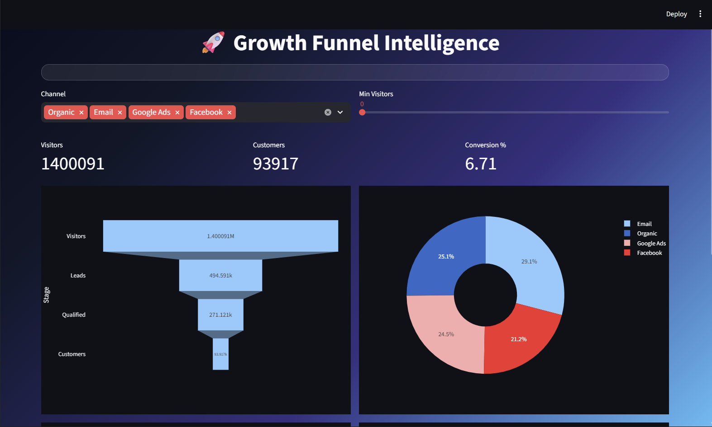
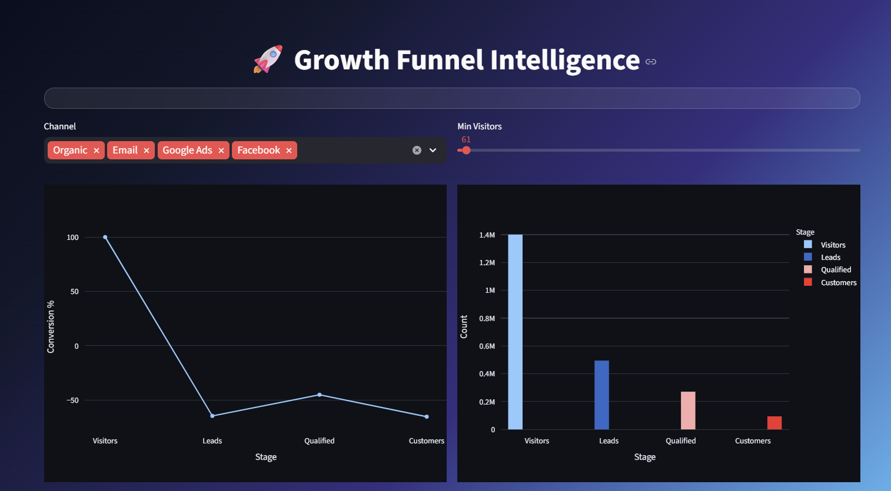
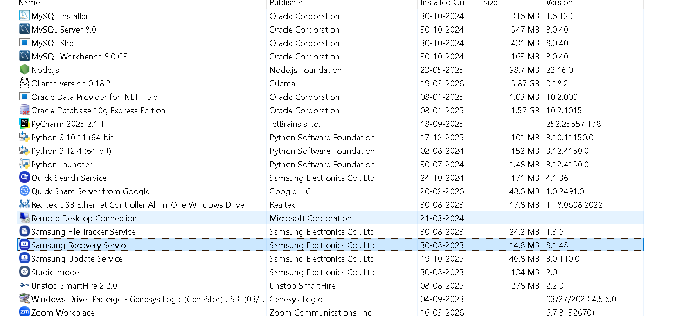
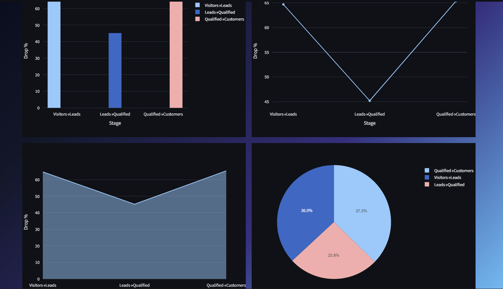
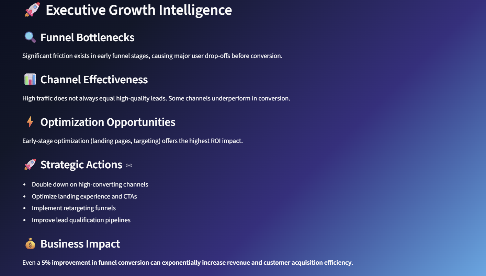

# 🚀 Marketing Funnel & Conversion Intelligence Dashboard

**Future Interns – Data Science & Analytics Internship · Task 3 · 2026**

### 🖥️ Dashboard Preview

| Overview | Funnel Flow |
|:---:|:---:|
|  |  |

| Channels | Drop-off |
|:---:|:---:|
|  |  |

| Insights |
|:---:|
|  |

> A premium multi-page dashboard designed to analyze user journey, conversion performance, and growth opportunities across marketing funnels.

---

## 🎯 Project Objective

This project focuses on analyzing how users move through a marketing funnel — from **visitors to customers** — and identifying where businesses lose potential revenue.

The goal is to transform funnel data into **actionable growth strategies**.

---

## 🚀 Live Dashboard

👉https://futureds03.streamlit.app/

---

## ⚡ Key Capabilities

- 🔻 Funnel visualization of user journey  
- 📉 Drop-off detection at each stage  
- 📊 Channel-wise performance comparison  
- 📈 Conversion trend analysis  
- 🎯 Growth-focused business recommendations  

---

## 📊 Funnel Stages Modeled

| Stage | Description |
|------|------------|
| 👀 Visitors | Initial traffic |
| 🧾 Leads | Interested users |
| 🎯 Qualified Leads | High-intent users |
| 💰 Customers | Final conversions |

---

## 🔍 Analytical Focus

- Conversion efficiency across funnel stages  
- Channel performance & lead quality  
- Bottleneck identification in user journey  
- Growth optimization opportunities  

---

## 💡 Key Observations

- Early-stage conversion significantly impacts overall performance  
- Not all high-traffic channels produce high-value customers  
- Funnel leakage is highest in initial engagement phases  
- Optimizing targeting improves downstream conversions  

---

## 🚀 Strategic Recommendations

- Improve landing page experience and CTAs  
- Focus on high-converting acquisition channels  
- Implement remarketing for dropped users  
- Enhance lead qualification mechanisms  

---

## 💰 Business Impact

Small improvements in funnel efficiency can lead to **exponential gains in revenue, acquisition efficiency, and customer growth**.

---

## 🛠️ Tech Stack

- Python  
- Streamlit  
- Pandas  
- Plotly  

---

## ▶️ Run Locally

pip install -r requirements.txt
streamlit run app.py

🚀 Built with a focus on Growth Analytics & Business Impact · 2026

